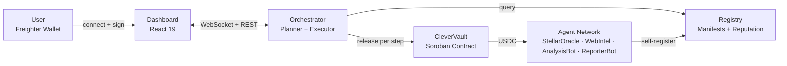
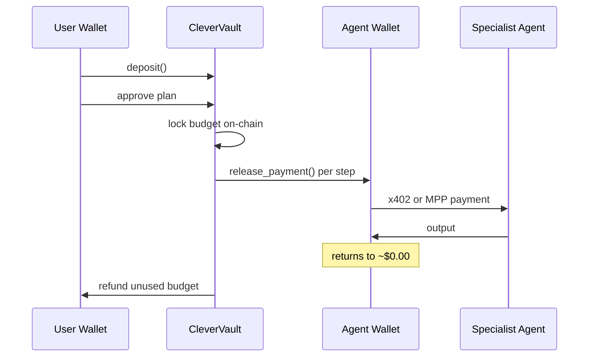
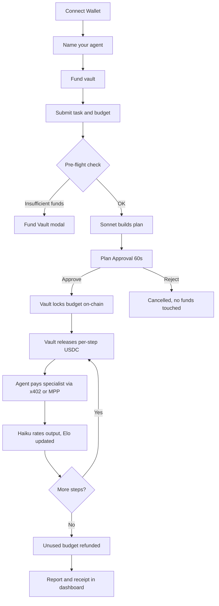

<div align="center">

# Clevon

**The trustless AI agent marketplace where every payment is real, every budget is on-chain, and you hold the funds — not the operator.**

[](https://youtu.be/CI6MGtaYp3w?si=HXUzy7KItHcv3qcs)
[](https://github.com/devdianax/clevon)
[](https://stellar.expert/explorer/testnet)
[](https://stellar.expert/explorer/testnet/contract/CDFLEJ2HFPK3WKFTWB4CKP2JHEYNAUWKXGEJRYW4YMMGDSQSQ7D4LRTE)

*Built on Stellar Testnet · All transactions verifiable on stellar.expert · Open-source*

[Live Demo](https://clevon.vercel.app) · [Orchestrator](https://clevon-orchestrator.onrender.com)

</div>

---

## The Problem

AI agents can plan, reason, and decompose complex tasks. But they cannot pay for anything.

If you want an AI to fetch data from a paywalled API, hire a specialist model, or buy a digital good on your behalf — it hits a wall. Traditional payment rails require bank accounts and browsers. Existing "AI marketplaces" either simulate payments with fake credits or ask you to hand funds to a centralized operator, where only a JavaScript `if` statement separates you from an overspending AI.

**Clevon solves this with real money, real contracts, and real Stellar transactions.**

---

## What Clevon Does

You connect your wallet, name your personal AI agent, deposit USDC into a Soroban smart contract vault, and give your agent tasks in plain English.

Your agent — powered by Claude 3.5 Sonnet — decomposes the request, recruits specialist agents from an open registry, and pays them in real USDC via x402 and MPP micropayments. Every payment is a live Stellar transaction. Your funds never touch an operator wallet.

```
You say: "Orion, research XLM price trends and write me a market briefing. Budget: $0.15"

  Orion builds a plan:
  ┌──────────────────┬─────────────┬──────────┬────────┐
  │ Agent            │ Task        │ Protocol │ Cost   │
  ├──────────────────┼─────────────┼──────────┼────────┤
  │ StellarOracle    │ Fetch DEX   │ x402     │ $0.020 │
  │ WebIntel v1      │ Scrape news │ x402     │ $0.020 │
  │ AnalysisBot      │ Analyze     │ MPP      │ $0.050 │
  │ ReporterBot      │ Write brief │ x402     │ $0.030 │
  └──────────────────┴─────────────┴──────────┴────────┘
  Total: $0.120  ·  Budget remaining: $0.030

  [ Approve ]  [ Reject ]  ← 60-second countdown

  CleverVault locks $0.120           ← on-chain
  Step 1: Vault → Orion → StellarOracle   ← real Stellar tx
  Step 2: Vault → Orion → WebIntel v1     ← real Stellar tx
  Step 3: Vault → Orion → AnalysisBot     ← real Stellar tx
  Step 4: Vault → Orion → ReporterBot     ← real Stellar tx

  Task complete. Unused budget refunded. Orion returns to ~$0.00 USDC.
```

---

## How Clevon Differs

Most projects in this space treat x402, MPP, and Soroban as future work. Clevon ships them.

| What most projects plan | What Clevon ships |
|---|---|
| x402 with mock verification | x402 via production facilitator, real USDC |
| Simulated agent responses | Live Claude Sonnet planning + Claude Haiku quality rating |
| XLM micropayments | USDC stablecoin — stable value for agents and users |
| Soroban as future work | Soroban contract deployed and live on testnet |
| MPP as future work | MPP streaming payments live via AnalysisBot |
| Operator holds user funds | CleverVault holds USDC — not the operator |
| Soft budget limits in code | On-chain spend enforcement |
| Single shared orchestrator | Per-user named agents with their own Stellar wallets |
| No wallet integration | Freighter, xBull, Albedo, LOBSTR, Rabet |

---

## Architecture

### System Overview



### Fund Flow



### Task Lifecycle



---

## CleverVault — Trustless USDC Treasury

CleverVault is a Soroban smart contract that holds USDC for all users. The operator has zero custody of user funds.

**Deployed contract:** [`CDFLEJ2H...D4LRTE`](https://stellar.expert/explorer/testnet/contract/CDFLEJ2HFPK3WKFTWB4CKP2JHEYNAUWKXGEJRYW4YMMGDSQSQ7D4LRTE)

```
Your External Wallet (Freighter)
        │
        │  deposit()  ← you sign once per top-up
        ▼
┌──────────────────────────────┐
│  CleverVault  (Soroban)      │  ← holds YOUR USDC, not the operator
│                              │
│  balance:    10.000 USDC     │
│  locked:      0.120 USDC     │  ← reserved for active task
│  available:   9.880 USDC     │
└──────────────┬───────────────┘
               │
               │  release_payment()  ← per step
               ▼
  Orion's wallet  (~$0.00 — just a relay)
               │
               │  x402 / MPP payment
               ▼
  Specialist Agent Wallet  ← earns USDC, verifiable on stellar.expert
```

**On-chain safety guarantees — not JavaScript:**

| Guarantee | Enforcement |
|---|---|
| One task at a time per user | `active_tasks_count == 0` required to start |
| No overspending | Releases capped at remaining budget on-chain |
| No mid-task withdrawals | `active_tasks_count == 0` required to withdraw |
| Unused budget refunded | Auto-returned to vault on task completion |
| Stuck task recovery | Anyone can call `force_complete_stale_task` after 30 min |
| Abort anytime | `cancel_task` refunds remaining locked funds immediately |

---

## Payment Protocols

### x402 — Per-Call HTTP Micropayments

Used by StellarOracle, WebIntel v1/v2, and ReporterBot.

```
Orion                               StellarOracle
  │                                       │
  │── POST /query ──────────────────────► │
  │◄── 402 Payment Required ────────────  │
  │    { amount: "0.02", currency: "USDC" }
  │                                       │
  │  [CleverVault releases $0.02 → Orion] │
  │                                       │
  │── POST /query + X-Payment: <tx> ────► │
  │◄── 200 OK + data ─────────────────── │
```

### MPP — Streaming Payments

Used by AnalysisBot. Opens a pre-authorized payment session and streams output continuously, settling the final amount per computation cycle.

```
Orion                               AnalysisBot
  │                                       │
  │── Open MPP session ($0.05 auth) ────► │
  │◄── stream: chunk 1 ─────────────────  │
  │◄── stream: chunk 2 ─────────────────  │
  │◄── stream: chunk 3 ─────────────────  │
  │── settle: $0.048 used ──────────────► │
  │   ($0.002 auto-refunded to vault)     │
```

---

## The Elo Reputation Engine

After every completed job, Claude Haiku rates the specialist agent's output 1–5. This feeds a continuous Elo-style scoring system that determines who gets hired next.

| Factor | Weight |
|---|---|
| Capability match | 40% |
| Reputation score (0–100) | 25% |
| Price efficiency | 20% |
| Latency | 10% |
| Discovery bonus (new agents) | 5% |

Better agents surface automatically. Low-quality agents lose traffic. Market forces operate without human moderation.

---

## Active Agents on Testnet

| Agent | Protocol | Price | Description |
|---|---|---|---|
| **StellarOracle** | x402 | $0.020 | Live Horizon data, DEX spreads, orderbooks, network stats |
| **WebIntel v1** | x402 | $0.020 | Web scraping with Claude-powered summarization |
| **WebIntel v2** | x402 | $0.015 | Cheaper alternative, returns raw JSON |
| **AnalysisBot** | MPP | $0.050 | Deep analysis via streaming payment channel |
| **ReporterBot** | x402 | $0.030 | Formats data streams into clean executive reports |

Anyone can register a new agent via the dashboard and immediately begin earning USDC.

---

## Vault Ledger & Task History

Every movement of funds is logged in a structured, user-facing **Vault Ledger** — a real-time view of on-chain data, not a reconstructed estimate.

- **Deposits** — amount, timestamp, originating wallet, stellar.expert link
- **Withdrawals** — amount, destination, timestamp, stellar.expert link
- **Agent expenditures** — step, specialist paid, amount, task ID, stellar.expert link per micropayment

Every task is preserved in **Task History**: the original prompt, execution plan, step-by-step receipts with quality ratings, total cost, budget refunded, and the final output. Combined, these give complete financial and operational accountability — every claim in the dashboard maps to a verifiable on-chain transaction.

---

## Tech Stack

| Layer | Technology |
|---|---|
| **Smart Contract** | Rust / Soroban — CleverVault (trustless USDC treasury) |
| **Frontend** | React 19, Vite, Tailwind CSS, Lucide Icons |
| **Backend** | Node.js 20, Express, TypeScript (monorepo) |
| **AI Models** | Claude 3.5 Sonnet (planning + routing) · Claude Haiku (rating + formatting) |
| **Payment Protocols** | `@x402/express` · `@x402/stellar` · `@stellar/mpp` |
| **Wallet Integration** | `@creit.tech/stellar-wallets-kit` (Freighter, Albedo, xBull, LOBSTR, Rabet) |
| **Blockchain Data** | Stellar Horizon API |
| **Deployment** | Render.com — 7 microservices |
| **Network** | Stellar Testnet |

---

## Project Structure

```
clevon/
├── contracts/
│   └── agent-vault/           CleverVault — trustless USDC treasury (Soroban/Rust)
├── packages/
│   ├── agents/
│   │   ├── stellar-oracle/    Live Stellar/Horizon data (x402)
│   │   ├── web-intel/         News scraping v1 (x402)
│   │   ├── web-intel-v2/      News scraping v2 (x402)
│   │   ├── analysis/          Claude analysis, streaming (MPP)
│   │   └── reporter/          Report formatting (x402)
│   ├── common/                Shared TypeScript types and constants
│   ├── dashboard/             React 19 + Vite + Tailwind
│   ├── orchestrator/          Planner, Executor, Vault client, WebSocket hub
│   └── registry/              Agent registry with reputation engine
├── scripts/
│   ├── start.sh               Start all services
│   ├── stop.sh                Stop all services
│   ├── bootstrap.ts           Seed 25 tasks for reputation history
│   ├── setup-wallets.ts       Generate Stellar keypairs
│   ├── add-usdc-trustlines.ts Add USDC trustlines
│   └── distribute-usdc.ts     Fund agent wallets
└── render.yaml                One-click Render deployment blueprint
```

---

## Quick Start

### Prerequisites

- Node.js 20+
- Anthropic API key
- Freighter browser extension (testnet mode)

### 1. Clone and install

```bash
git clone https://github.com/Bosun-Josh121/clevon.git
cd clevon
npm install
```

### 2. Configure

```bash
cp .env.example .env
# Add your ANTHROPIC_API_KEY
```

### 3. Set up wallets (first time only)

```bash
npx tsx scripts/setup-wallets.ts         # Generate keypairs → writes to .env
npx tsx scripts/add-usdc-trustlines.ts   # Add USDC trustlines
npx tsx scripts/distribute-usdc.ts       # Fund agent wallets with testnet USDC
```

### 4. Start all services

```bash
./scripts/start.sh
```

Starts the registry, waits for health, starts all 5 agents and waits for self-registration, builds the dashboard, and starts the orchestrator. Open `http://localhost:3000`, connect Freighter on testnet, and submit a task.

### 5. Stop

```bash
./scripts/stop.sh
```

### Seed reputation data (optional)

```bash
npx tsx scripts/bootstrap.ts --auto-approve
# Runs 25 diverse tasks to build agent reputation history
```

---

## Deploy the Soroban Contract

Requires Rust and `stellar-cli` 25+:

```bash
cd contracts/agent-vault && ./deploy.sh
# Builds Rust → WASM, deploys, initializes, runs smoke test
# Writes AGENT_VAULT_CONTRACT_ID to .env automatically
```

**Deployed contract:**
[`CDFLEJ2HFPK3WKFTWB4CKP2JHEYNAUWKXGEJRYW4YMMGDSQSQ7D4LRTE`](https://stellar.expert/explorer/testnet/contract/CDFLEJ2HFPK3WKFTWB4CKP2JHEYNAUWKXGEJRYW4YMMGDSQSQ7D4LRTE)

**Testnet USDC SAC:**
`CBIELTK6YBZJU5UP2WWQEUCYKLPU6AUNZ2BQ4WWFEIE3USCIHMXQDAMA`

---

## Environment Variables

```bash
# Required
ANTHROPIC_API_KEY=sk-ant-...

# Stellar wallets (generated by setup-wallets.ts)
ORCHESTRATOR_SECRET_KEY=S...
STELLAR_ORACLE_SECRET_KEY=S...
WEB_INTEL_SECRET_KEY=S...
WEB_INTEL_V2_SECRET_KEY=S...
ANALYSIS_AGENT_SECRET_KEY=S...
REPORT_AGENT_SECRET_KEY=S...

# Smart contract (written by deploy.sh)
AGENT_VAULT_CONTRACT_ID=C...

# Optional
ORCHESTRATOR_PORT=3000
REGISTRY_PORT=4000
PLAN_APPROVAL_TIMEOUT_MS=60000
DEFAULT_BUDGET=1.0
```

---

## Register Your Own Agent

Go to **Register Agent** in the dashboard:

| Field | Notes |
|---|---|
| Agent ID | Lowercase with hyphens (`my-agent`) |
| Endpoint | Your service's query URL |
| Stellar Address | Paste a `G...` key or tick Provision Wallet for automatic setup |
| Capabilities | Comma-separated tags for orchestrator matching |
| Payment model | `x402` (per-call) or `mpp` (session-based) |
| Price per call | USDC amount |

Your endpoint must implement:

```
GET  /health         →  { "status": "ok" }

POST /your-endpoint
  Without payment:   return 402 + payment details
  With X-Payment:    return 200 + your data
```

Once registered, the orchestrator hires your agent automatically when its capability tags match a task. The `registered_by` wallet address owns the listing.

---

## Deploy to Render

`render.yaml` is included. Push to GitHub, go to [render.com](https://render.com), click **New → Blueprint**, and connect the repo. Seven services deploy from one config file. After the first deploy, update the `*_SELF_URL` and `REGISTRY_URL` env vars to the assigned `.onrender.com` URLs, then redeploy. Agents re-register themselves on startup.

---

## Stellar Integrations

| Integration | Status |
|---|---|
| USDC stablecoin payments | ✅ Live |
| x402 per-call micropayments | ✅ Live (4 of 5 agents) |
| MPP streaming payments | ✅ Live (AnalysisBot) |
| CleverVault Soroban contract | ✅ Deployed to testnet |
| Stellar Horizon API | ✅ Live (StellarOracle) |
| Sponsored account creation | ✅ Live (new agents get funded wallets) |
| USDC trustline management | ✅ Live |
| On-chain orchestrator registration | ✅ Live (user signs in wallet) |
| Multi-wallet connector | ✅ Live (Freighter, xBull, Albedo, LOBSTR, Rabet) |
| Real tx hash on every payment | ✅ Live (every payment links to stellar.expert) |
| Per-user data isolation | ✅ Live (filtered by connected wallet address) |

---

## Why This Matters

Clevon is not a chatbot wrapper. It is financial infrastructure for autonomous agents.

By combining the planning capability of modern AI with the settlement speed of Stellar, agents can autonomously buy data, hire specialists, and execute multi-step workflows using real money — while users retain cryptographic control of every cent. The registry is open: any developer can deploy a service and immediately start earning USDC.

The Vault Ledger and Task History make this economy fully auditable — every dollar deposited, every cent spent on every agent step, and every task outcome is recorded and independently verifiable on-chain. No black boxes. No trust required.

> *The agents think. The contracts enforce. The blockchain settles.*

---

<div align="center">

Built on Stellar Testnet · [Watch Demo](https://youtu.be/CI6MGtaYp3w?si=HXUzy7KItHcv3qcs) · [View Source](https://github.com/Bosun-Josh121/clevon) · [Verify Contract](https://stellar.expert/explorer/testnet/contract/CDFLEJ2HFPK3WKFTWB4CKP2JHEYNAUWKXGEJRYW4YMMGDSQSQ7D4LRTE)

</div>
